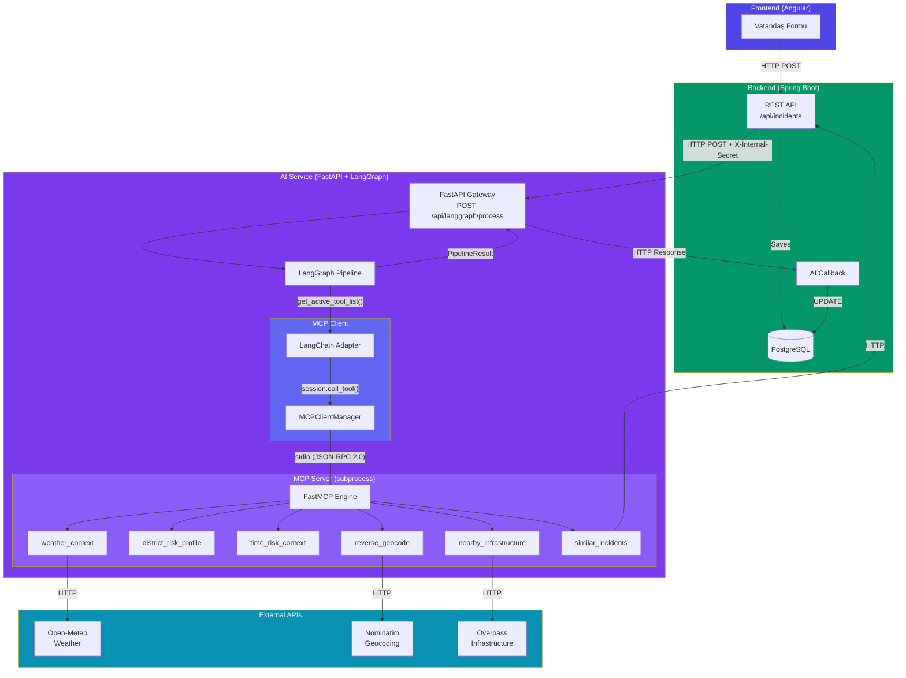
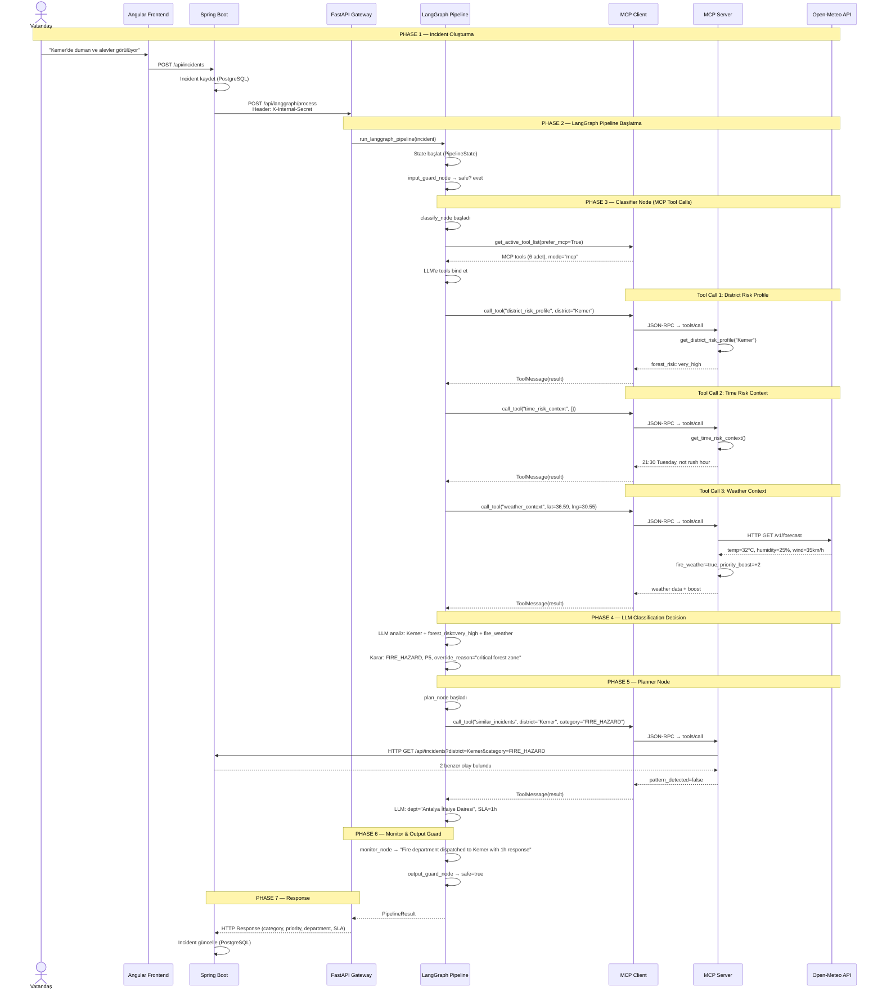
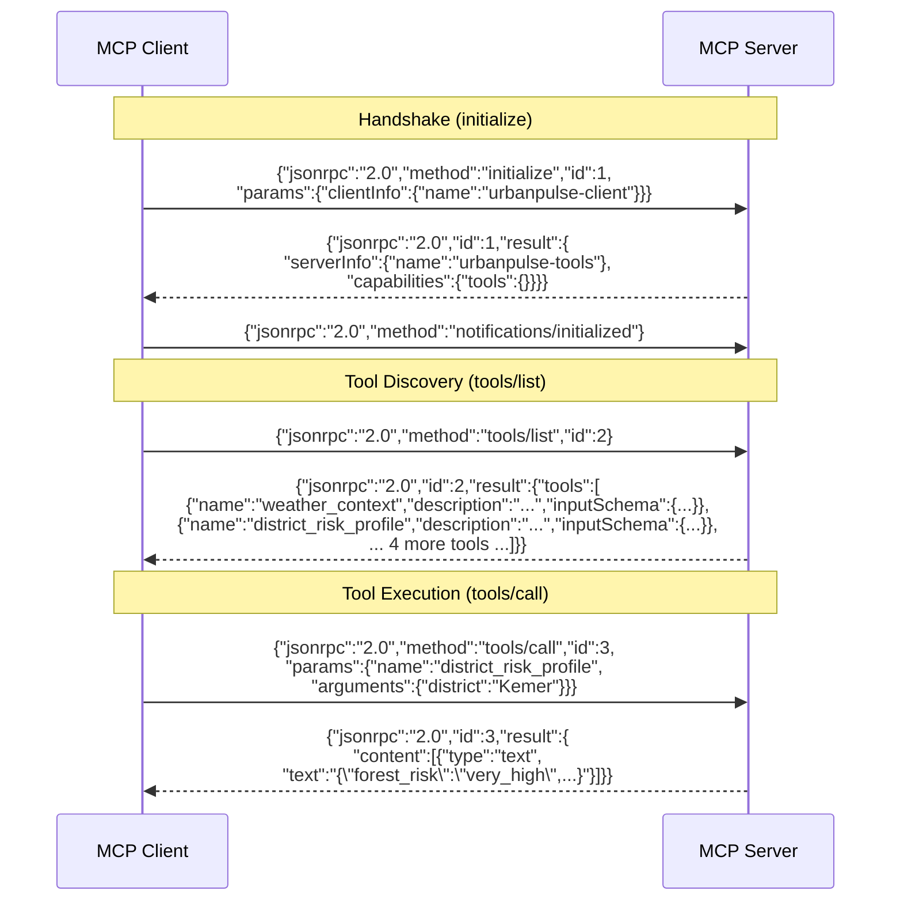
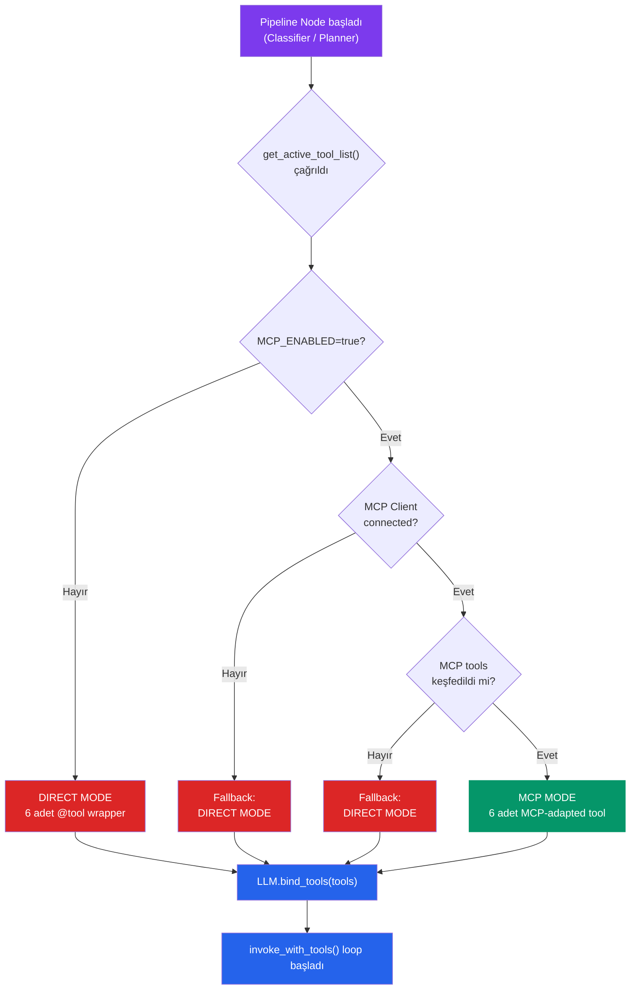
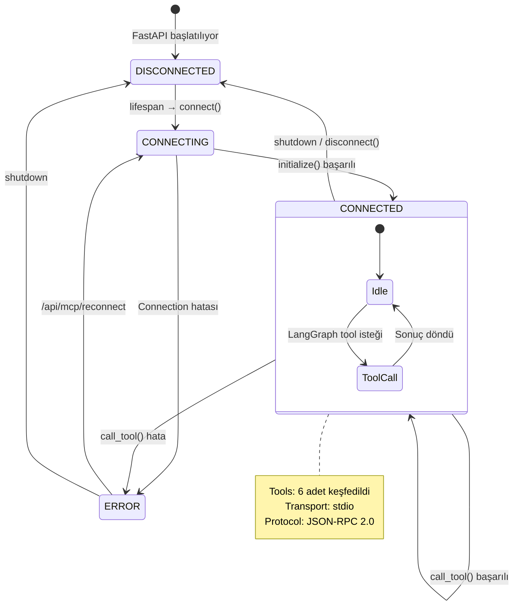
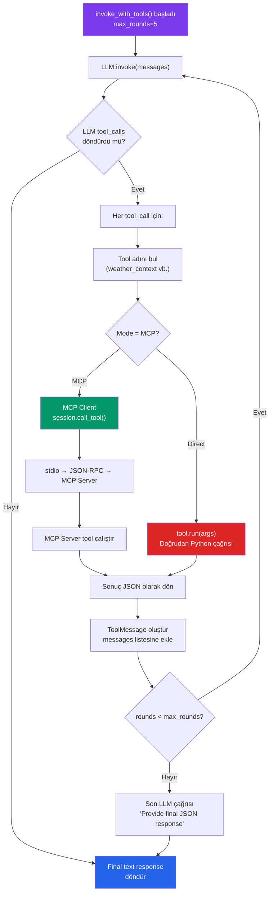
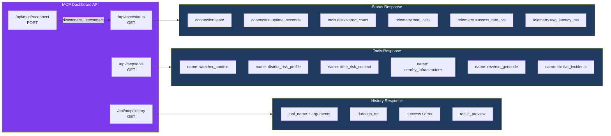

# UrbanPulse MCP — Incident Processing Flow

> Bu doküman, bir vatandaş şikayeti (incident) oluştuğu andan itibaren  
> MCP sisteminin tüm katmanlardan nasıl geçtiğini, adım adım açıklar.

---

## 1. Büyük Resim — Sistem Mimarisi



---

## 2. Incident Yaşam Döngüsü — Sequence Diagram

Aşağıdaki diyagram, bir "Kemer'de orman yangını" şikayetinin tüm sistemden geçiş sürecini gösterir:



---

## 3. MCP İletişim Protokolü — JSON-RPC 2.0

MCP Client ve Server arasındaki iletişim standart JSON-RPC 2.0 mesajlarıyla yapılır. Bu mesajlar **stdio** (stdin/stdout) üzerinden iletilir:



---

## 4. Dual-Mode Tool Resolution — Karar Akışı

Pipeline'ın MCP veya Direct mode arasında nasıl karar verdiğini gösteren akış:



---

## 5. MCP Client Lifecycle — Yaşam Döngüsü



---

## 6. Tool Call Akışı — invoke_with_tools() Loop

Her node (classifier, planner) içindeki tool calling loop'u:



---

## 7. MCP Dashboard — Monitoring Endpoint'leri



---

## 8. Gerçek Dünya Senaryosu — Adım Adım

Aşağıda **Kemer'de orman yangını** senaryosunun her katmanda nasıl işlendiği anlatılır:

### Adım 1: Vatandaş Bildirimi
```
Başlık: "Kemer'de duman ve alevler görülüyor"
Açıklama: "Kemer ilçesinde ormanlık alanda yoğun duman ve alevler var"
Kategori (kullanıcı): FIRE_HAZARD
Öncelik (kullanıcı): P3
Koordinat: 36.5937, 30.5567
İlçe: Kemer
```

### Adım 2: MCP Tool Call'ları (Classifier)

| Sıra | Tool | Sonuç |
|------|------|-------|
| 1 | `district_risk_profile("Kemer")` | forest_risk=**very_high**, tourism_zone=true, mountain_terrain=true |
| 2 | `time_risk_context()` | 21:30, Tuesday, not rush hour |
| 3 | `weather_context(36.59, 30.55)` | 32°C, humidity=25%, wind=35km/h → **fire_weather=true**, priority_boost=+2 |

### Adım 3: LLM Kararı (Classifier)
```json
{
  "category": "FIRE_HAZARD",
  "priority": 5,
  "confidence": 0.98,
  "reasoning": "Kemer has very high forest fire risk. Current weather shows fire conditions with high temperature, low humidity and strong wind. User reported P3 but this is critically underestimated.",
  "override_reason": "Critical forest fire zone with active fire weather conditions"
}
```

### Adım 4: MCP Tool Call'ları (Planner)

| Sıra | Tool | Sonuç |
|------|------|-------|
| 1 | `similar_incidents("Kemer", "FIRE_HAZARD")` | 0 benzer olay, pattern_detected=false |
| 2 | `district_risk_profile("Kemer")` | forest_risk=very_high |

### Adım 5: LLM Kararı (Planner)
```json
{
  "department": "Antalya İtfaiye Dairesi",
  "sla_hours": 1,
  "action_note": "Emergency fire response units dispatched to Kemer forest area. Aerial support requested due to mountainous terrain and difficult access. Tourism zone evacuation protocol initiated."
}
```

### Adım 6: Monitor Özeti
```
"Fire department units with aerial support are dispatched to Kemer with a 1-hour emergency response time due to critical forest fire conditions."
```

---

## 9. MCP vs Direct Mode Karşılaştırma

```mermaid
graph TD
    subgraph MCP["MCP Mode"]
        M1["LangGraph Node"] -->|"get_active_tool_list()"| M2["MCP Adapter"]
        M2 -->|"session.call_tool()"| M3["MCP Client Manager"]
        M3 -->|"JSON-RPC over stdio"| M4["MCP Server Process"]
        M4 -->|"import & execute"| M5["urbanpulse.tools.*"]
        M5 -->|"HTTP"| M6["External APIs"]
    end

    subgraph Direct["Direct Mode"]
        D1["LangGraph Node"] -->|"get_active_tool_list()"| D2["@tool wrappers"]
        D2 -->|"direct import"| D3["urbanpulse.tools.*"]
        D3 -->|"HTTP"| D4["External APIs"]
    end

    style MCP fill:#059669,color:#fff
    style Direct fill:#dc2626,color:#fff
```



| Özellik | Direct Mode | MCP Mode |
|---------|------------|----------|
| **Hız** | Daha hızlı (in-process) | Biraz yavaş (IPC overhead) |
| **Keşif** | Hardcoded import | Dinamik `tools/list` |
| **Protokol** | Python-specific | Standart JSON-RPC 2.0 |
| **İzolasyon** | Aynı process | Ayrı subprocess |
| **Taşınabilirlik** | Sadece LangChain | Herhangi bir MCP client |
| **Gözlemlenebilirlik** | Manuel loglama | Dahili telemetri |
| **Kullanım** | Fallback | Varsayılan (tercih edilen) |

---

## 10. Terminal Log Çıktısı Örneği

MCP modunda bir incident işlenirken terminalde görülen loglar:

```
[MCP-SERVER] INFO  UrbanPulse MCP Server v3.0.0 starting (transport=stdio)
[MCP-SERVER] INFO  Registered 6 tools, 2 resources
[MCP-SERVER] INFO  Processing request of type ListToolsRequest

[AI-SERVICE] INFO  mcp_client_connected tools_count=6
[AI-SERVICE] INFO  classifier_tools_resolved mode=mcp count=6
[AI-SERVICE] INFO  tool_loop_start mode=mcp max_rounds=5 available_tools=[...]

[AI-SERVICE] INFO  tool_call_dispatch mode=mcp tool=district_risk_profile round=1
[MCP-SERVER] INFO  Tool called: district_risk_profile(district=Kemer)
[MCP-SERVER] INFO  Tool result: district_risk_profile → FOREST FIRE RISK: very_high
[AI-SERVICE] INFO  mcp_tool_call_complete tool=district_risk_profile duration_ms=12

[AI-SERVICE] INFO  tool_call_dispatch mode=mcp tool=time_risk_context round=1
[MCP-SERVER] INFO  Tool called: time_risk_context()
[AI-SERVICE] INFO  mcp_tool_call_complete tool=time_risk_context duration_ms=8

[AI-SERVICE] INFO  tool_call_dispatch mode=mcp tool=weather_context round=1
[MCP-SERVER] INFO  Tool called: weather_context(lat=36.59, lng=30.55)
[MCP-SERVER] INFO  HTTP Request: GET https://api.open-meteo.com/v1/forecast "200 OK"
[AI-SERVICE] INFO  mcp_tool_call_complete tool=weather_context duration_ms=856

[AI-SERVICE] INFO  tool_loop_end mode=mcp rounds_used=1 reason=no_more_tool_calls
[AI-SERVICE] INFO  planner_tools_resolved mode=mcp count=6
[AI-SERVICE] INFO  langgraph_pipeline_complete category=FIRE_HAZARD priority=5 ms=4521
```
