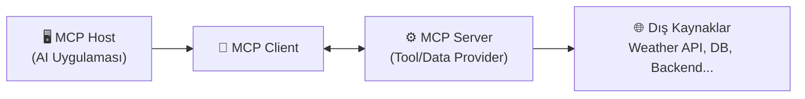

# 🔍 MCP Analizi & UrbanPulse Entegrasyon Planı

## 1. MCP Nedir?

**MCP = Model Context Protocol** — Anthropic tarafından geliştirilen, açık standart bir protokoldür. Amaç:

> **AI modellerinin (LLM) dış dünyayla (araçlar, veri kaynakları, servisler) standartlaştırılmış bir şekilde iletişim kurmasını sağlamak.**

Basitçe: MCP, AI uygulamaları için bir **"USB-C portu"** gibi düşünülebilir — hangi AI modeli, hangi veri kaynağı olursa olsun, aynı protokolle konuşabilirler.

### MCP'nin 3 Temel Bileşeni



| Bileşen | Açıklama | UrbanPulse'daki Karşılığı |
|---------|----------|---------------------------|
| **MCP Host** | AI uygulamasının kendisi (LLM'i barındıran uygulama) | FastAPI + LangGraph Pipeline |
| **MCP Client** | Host içinde çalışan, MCP Server'larla konuşan modül | LangChain tool binding sistemi (şu an) |
| **MCP Server** | Tool ve veri kaynağını standart formatta sunan sunucu | Her bir tool fonksiyonu (weather, risk_profile vb.) |

### MCP vs Mevcut Tool Calling — Fark Ne?

| Özellik | Şu Anki Sistem (LangChain Tools) | MCP |
|---------|----------------------------------|-----|
| Protokol | LangChain'e özgü `@tool` dekoratörü | Evrensel JSON-RPC 2.0 over stdio/SSE |
| Keşfedilebilirlik | Hardcoded tool listesi | Dinamik tool discovery |
| Taşınabilirlik | Sadece LangChain ekosistemi | Herhangi bir AI framework |
| Standart | Yok | Açık standart (Anthropic) |
| Server Bağımsızlığı | Tool'lar aynı process'te | Server ayrı process, hatta uzak makine |

---

## 2. Hocanız Ne İstiyor?

Mesajı parçalayalım:

> *"We will **implement** and **assess** MCP during our class hours."*

→ MCP'yi projenizde **gerçekten çalışır halde** görmek istiyor (teorik değil).

> *"You will need to **demonstrate** within your project how MCP works and **explain its function** clearly."*

→ Canlı demo yapacaksınız + nasıl çalıştığını teknik olarak anlatabilmeniz lazım.

> *"Make sure your project **shows the process and results** so everyone can see how MCP operates."*

→ Sadece sonuç değil, **sürecin kendisi** (tool çağrısı, veri akışı, response) görünür olmalı.

### Somut Beklentiler

| # | Beklenti | Anlamı |
|---|----------|--------|
| 1 | **MCP Server implementasyonu** | Mevcut tool'larınızı (weather, risk_profile, infrastructure vb.) MCP Server olarak expose etmeniz |
| 2 | **MCP Client entegrasyonu** | LangGraph pipeline'ın MCP üzerinden tool'ları çağırması |
| 3 | **Canlı Demo** | Bir incident gönderip, MCP'nin tool discovery → tool call → result döndürme sürecini göstermek |
| 4 | **Açıklama** | MCP'nin ne olduğu, neden standart bir protokol gerektiği, mimari avantajları |
| 5 | **Process Görünürlüğü** | Loglar, UI veya terminal çıktısıyla MCP iletişiminin her adımını izlenebilir kılmak |

---

## 3. Mevcut Durum Analizi — Zaten Yarıda Sınız!

> [!TIP]
> UrbanPulse projeniz zaten MCP'nin **kavramsal** altyapısını içeriyor. Şu an yaptığınız şey aslında MCP'nin informal bir implementasyonu:

### Şu An Var Olan

```
LangGraph Pipeline (Host)
    ├── classify_node → LLM + Tools (weather, risk, time, infrastructure, geo, patterns)
    ├── plan_node     → LLM + Tools (similar_incidents, risk, time)
    ├── monitor_node  → LLM (no tools)
    └── guards        → LLM (input/output guardrails)
```

- ✅ 6 adet fonksiyonel tool (`tools/` klasörü)
- ✅ LangChain `@tool` wrapper'ları (`langgraph_pipeline/tools.py`)
- ✅ Tool calling loop (`invoke_with_tools` in `utils.py`)
- ✅ Harici API entegrasyonları (Open-Meteo, Overpass, Nominatim, Spring Backend)

### Eksik Olan — MCP Katmanı

- ❌ MCP Server (tool'ları standart MCP protokolüyle sunan bağımsız server)
- ❌ MCP Client (pipeline'ın MCP üzerinden tool'ları keşfedip çağırması)
- ❌ MCP sürecini loglaması / görselleştirmesi
- ❌ MCP'nin faydalarını gösteren karşılaştırma

---

## 4. Uygulama Planı

### Faz 1: MCP Server — Tool'ları Expose Et ⚙️

Mevcut 6 tool'u (`weather`, `risk_profile`, `time_context`, `infrastructure`, `geocoding`, `patterns`) bir MCP Server olarak ayağa kaldıracağız.

**Teknoloji:** `mcp` Python SDK'sı (resmi Anthropic paketi)

```
ai-service/
├── src/urbanpulse/
│   ├── mcp_server/           ← YENİ
│   │   ├── __init__.py
│   │   └── server.py         ← MCP Server (tool'ları expose eder)
│   ├── tools/                ← MEVCUT (değişmez)
│   │   ├── weather.py
│   │   ├── risk_profile.py
│   │   ├── infrastructure.py
│   │   ├── geocoding.py
│   │   ├── patterns.py
│   │   └── time_context.py
```

**server.py** şunu yapacak:
1. Her tool fonksiyonunu MCP `Tool` olarak register eder
2. Tool'ların `name`, `description`, `inputSchema` (JSON Schema) bilgilerini otomatik sunar
3. `stdio` veya `SSE` transport üzerinden MCP Client'lara hizmet verir

### Faz 2: MCP Client — Pipeline'ı Bağla 🔌

LangGraph pipeline'ı, tool'ları doğrudan import etmek yerine **MCP üzerinden dinamik olarak keşfedip çağıracak** şekilde güncelleyeceğiz.

```
ai-service/
├── src/urbanpulse/
│   ├── mcp_client/           ← YENİ
│   │   ├── __init__.py
│   │   └── adapter.py        ← MCP Client → LangChain Tool adapter
│   ├── langgraph_pipeline/
│   │   ├── tools.py          ← GÜNCELLENİR (MCP'den tool'ları çeker)
```

**adapter.py** şunu yapacak:
1. MCP Server'a bağlanır
2. `tools/list` ile mevcut tool'ları keşfeder
3. Her birini LangChain-uyumlu `Tool` nesnesine dönüştürür
4. LangGraph pipeline'a enjekte eder

### Faz 3: Logging & Demo Görünürlüğü 📊

MCP sürecindeki her adımı logla ve göster:

| Adım | Log Çıktısı |
|------|-------------|
| **1. Tool Discovery** | `[MCP] Server'dan 6 tool keşfedildi: weather_context, district_risk, ...` |
| **2. Tool Call** | `[MCP] Tool çağrısı: district_risk_tool({district: "Kemer"})` |
| **3. Tool Result** | `[MCP] Sonuç: {flood_risk: "HIGH", forest_fire_risk: "EXTREME", ...}` |
| **4. LLM Decision** | `[MCP] LLM karar: P5 FIRE_HAZARD → İtfaiye Dairesi, SLA: 1h` |

### Faz 4: Demo Senaryosu 🎬

Ders sırasında gösterilecek senaryo:

1. **Tool olmadan** → LLM sadece metin analiz eder, Kemer'in orman yangını riski bilmez
2. **MCP ile** → LLM dinamik olarak tool'ları keşfeder, çağırır, kontekst zenginleştirir
3. **Sonuç karşılaştırması** → Aynı incident, farklı sonuçlar

---

## 5. Tahmini İş Yükü

| Faz | Süre | Karmaşıklık |
|-----|------|-------------|
| Faz 1: MCP Server | ~2-3 saat | Orta |
| Faz 2: MCP Client + Adapter | ~2-3 saat | Orta-Yüksek |
| Faz 3: Logging | ~1 saat | Düşük |
| Faz 4: Demo hazırlığı | ~1 saat | Düşük |
| **Toplam** | **~6-8 saat** | |

---

## 6. Karar Gerekli Noktalar

> [!IMPORTANT]
> Devam etmeden önce şu soruları cevaplamanız gerekiyor:

1. **Hangi transport?** MCP Server'ı `stdio` (aynı makine, process spawn) mı yoksa `SSE` (HTTP üzerinden, ayrı port) mi kullanacağız?
   - **Önerim:** `stdio` — demo için daha basit, kurulum gerektirmez
   - `SSE` daha gerçekçi ama ek konfigürasyon ister

2. **Mevcut tool calling korunacak mı?** MCP'yi ek olarak mı ekleyelim (dual mode) yoksa tamamen mi geçiş yapalım?
   - **Önerim:** Dual mode — demo sırasında "önce eski hal, sonra MCP" karşılaştırması yapabilirsiniz

3. **Demo ortamı nedir?** Lokal terminalde mi göstereceksiniz, yoksa frontend üzerinde bir MCP panel mi olsun?
   - **Önerim:** Terminal logları + basit bir MCP dashboard endpoint'i (FastAPI'de `/api/mcp/status`)

4. **Zaman kısıtı var mı?** Ders tarihi ne zaman? Buna göre planı daraltabiliriz.
