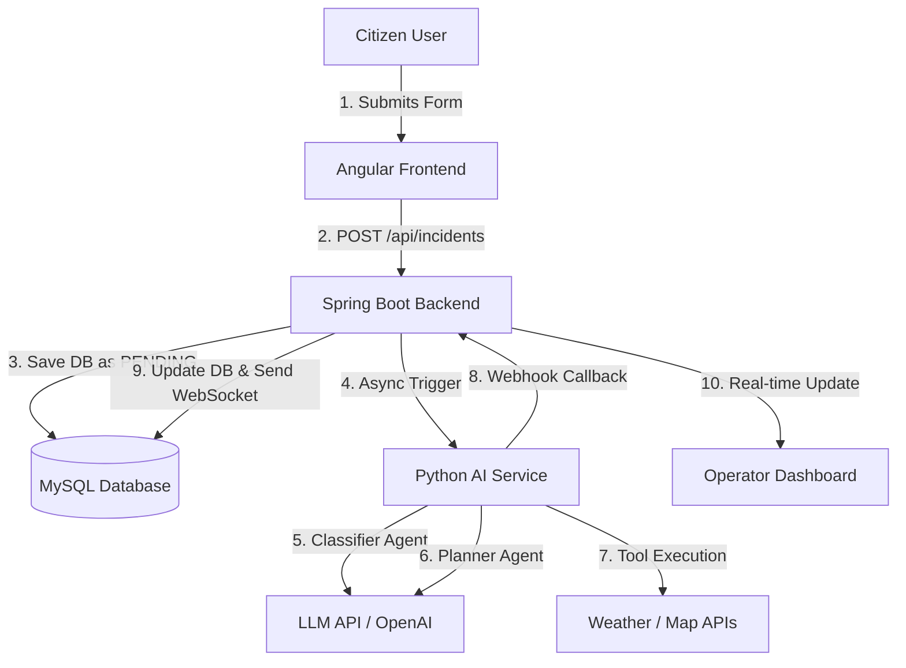

# UrbanPulse: AI Agent Planning Document

**Course:** AI Agent Systems, Spring 2026  
**Assignment:** Homework 2 - Website Development & AI Agent Planning

---

## 1. Project Overview

### Website Topic and Purpose

**UrbanPulse** is a Smart City Event & Traffic Management Platform. Its primary purpose is to provide a centralized hub for citizens and municipal operators to report, track, and resolve urban incidents (such as traffic accidents, road damage, flooding, or power outages). By digitizing urban incident reporting, the platform aims to reduce response times and improve city infrastructure maintenance.

### Target Users

1. **Citizens (Reporters):** Everyday residents who encounter urban issues and use the platform to report them via a map-based interface.
2. **Municipal Staff (Operators):** City workers and emergency dispatchers who monitor the dashboard, review incoming reports, and dispatch the necessary departments to resolve the issues.
3. **City Administrators:** High-level officials who view aggregated statistics and key performance indicators (KPIs) to make long-term urban planning decisions.

### Core Features of the Website

- **Home/Landing Page:** Brief introduction to the platform and live statistics.
- **Interactive Map & Reporting (Frontend):** A Leaflet-based map where users can drop pins to report incidents in real-time.
- **Operator Dashboard:** A secure admin panel displaying live incidents, statuses, and performance metrics.
- **Real-Time Updates:** WebSocket integration ensuring that operators see new reports instantly without refreshing the page.
- **RESTful Backend API:** A robust Spring Boot backend handling data persistence, user authentication (JWT), and business logic.

---

## 2. AI Agent Concept

### What problem will the AI agent solve?

Currently, when a citizen submits an incident, a human operator must manually review the description, assess its severity, assign a priority level, and route it to the correct municipal department (e.g., Fire Department, Public Works, Traffic Control). In a sprawling metropolis, high volumes of reports can lead to extreme delays. The AI agent will solve this bottleneck by instantly automating the triage and routing process, ensuring critical incidents are handled without human delay.

### What type of agent will it be?

The system will feature a **Multi-Agent Triage and Coordination System**, acting primarily as an **Evaluator & Assistant**.
Specifically, it will consist of a pipeline of specialized agents:

1. **Classifier Agent:** Evaluates the text and context to determine the incident category and priority.
2. **Planner Agent:** Assigns the correct municipal department and sets Service Level Agreement (SLA) deadlines (e.g., "Must resolve within 2 hours").
3. **Monitor Agent:** Continuously runs in the background to track unresolved incidents and automatically escalates them if SLA deadlines are breached.

### How users will interact with the agent

Users will not chat with the agent directly. Instead, it will be a **Background Automation Agent**.

- When a citizen submits a form (e.g., "Water pipe burst on Main St, flooding the road"), the backend will intercept this request.
- The AI Agent pipeline will instantly process the text, tag it as `Priority 5 (Critical)` and `Category: FLOODING`, and assign it to `Water & Sewage Department`.
- Municipal operators will see the AI's decision on their dashboard as an "AI Recommendation," which they can either accept or override.

---

## 3. System Architecture (High-Level)

### Architecture Flow

The AI integration will operate via a microservices architecture to keep the heavy AI processing decoupled from the core web backend.

1. **Frontend (Angular):** User submits the incident form via POST request to the Spring Boot backend.
2. **Backend (Spring Boot):**
   - Saves the raw incident as `PENDING`.
   - Sends an asynchronous HTTP payload to the independent Python AI Service.
3. **AI Service (Python/FastAPI/LangGraph):**
   - Receives the payload.
   - Executes the Classifier -> Planner -> Monitor pipeline using Large Language Models (LLMs) and custom tools (e.g., checking weather APIs or historical incident databases).
   - Posts a webhook callback to the Spring Boot backend with the final decision.
4. **Backend (Spring Boot):** Updates the incident status in the MySQL database and pushes a WebSocket event.
5. **Frontend (Angular):** Operator dashboard instantly updates with the AI-assigned priority and department.

### Simple Architecture Diagram

---

_End of Planning Document._
